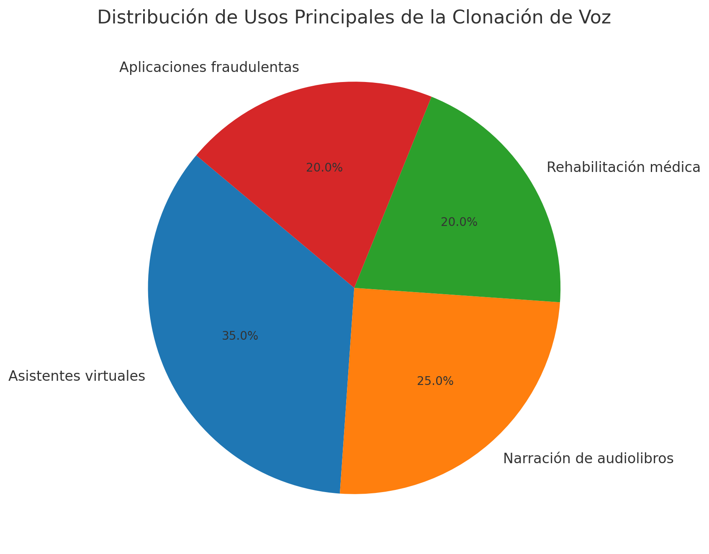
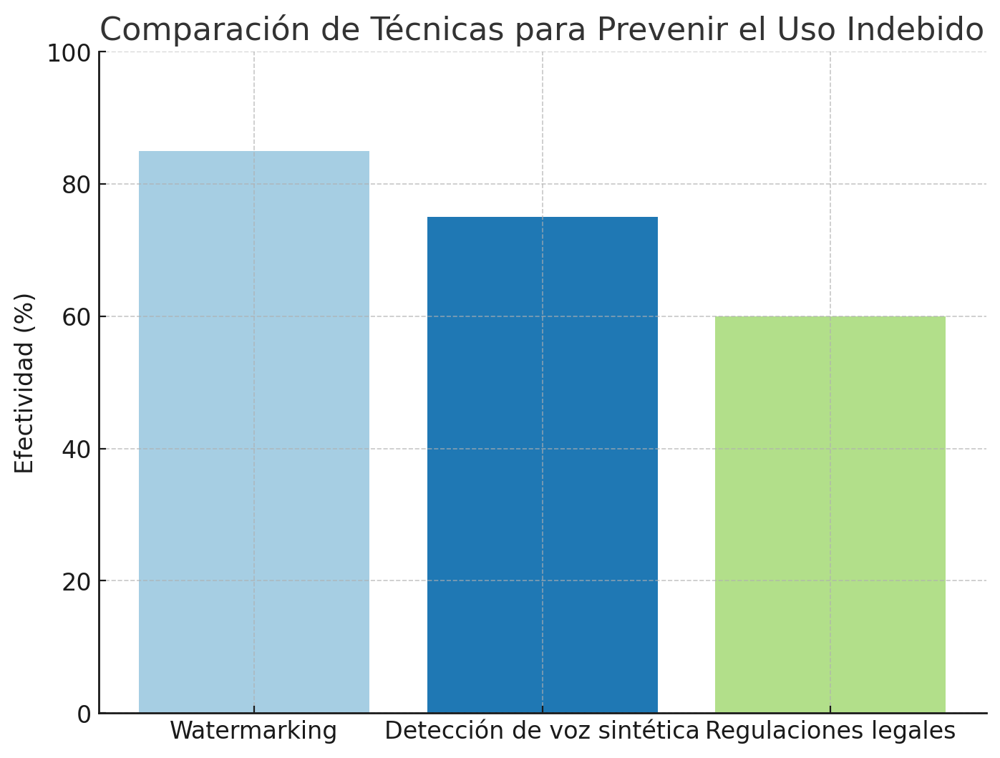

# **Voces Digitales: Explorando los Modelos LLM de Clonación de Voz y su Impacto en la Privacidad**

### Cinco puntos clave sobre los LLMs de clonación de voz:

1. **Características y LLMs locales**:  
   Modelos como picoLLM, desarrollados por Picovoice, permiten implementar soluciones de clonación de voz en dispositivos locales. Esto reduce la latencia y mejora la privacidad al evitar el procesamiento en la nube. picoLLM admite modelos como Llama y Mistral, que son populares en tareas de procesamiento de texto y voz. Estas soluciones están diseñadas para optimizar aplicaciones locales como asistentes de voz y sistemas de transcripción en tiempo real [oai_citation:8‡Stolen Voices: The Legal Battle Against AI Voice Cloning](https://killthedj.com/ai-voice-cloning-legal-overview/) [oai_citation:7‡picoLLM — Local LLM Platform — Picovoice](https://picovoice.ai/blog/picollm-local-llm-platform/).

2. **Política de privacidad**:  
   La clonación de voz plantea preocupaciones éticas y de privacidad. Empresas como OpenAI implementan políticas estrictas que restringen el uso indebido de sus modelos, mientras que soluciones locales, como picoLLM, permiten a las organizaciones procesar datos directamente en sus dispositivos, minimizando riesgos de fuga de información [oai_citation:6‡Stolen Voices: The Legal Battle Against AI Voice Cloning](https://killthedj.com/ai-voice-cloning-legal-overview/) [oai_citation:5‡OpenAI's Voice Engine: Redefining Voice Cloning Technology](https://www.analyticsvidhya.com/blog/2024/04/openai-develops-new-voice-cloning-ai-voice-engine/).

3. **Caso interesante de uso**:  
   Una aplicación innovadora ocurrió con un modelo de clonación de voz que ayudó a recrear la voz de un paciente que había perdido la capacidad de hablar debido a una enfermedad. Esto permitió a la persona comunicarse con su voz original en un asistente de texto a voz [oai_citation:4‡Stolen Voices: The Legal Battle Against AI Voice Cloning](https://killthedj.com/ai-voice-cloning-legal-overview/).

4. **Uso malicioso viral**:  
   En 2023, un fraude que utilizó tecnología de clonación de voz se volvió viral. Estafadores usaron una imitación precisa de la voz de un CEO para engañar a un empleado y transferir grandes sumas de dinero. Este caso subraya los peligros potenciales de la clonación de voz y la necesidad de implementar tecnologías para verificar la autenticidad de las voces en tiempo real [oai_citation:3‡OpenAI's Voice Engine: Redefining Voice Cloning Technology](https://www.analyticsvidhya.com/blog/2024/04/openai-develops-new-voice-cloning-ai-voice-engine/).

5. **Regulaciones y futuro**:  
   La clonación de voz impulsa el debate sobre la regulación de la IA. Mientras algunos gobiernos avanzan en políticas de protección de datos, los desarrolladores están trabajando en mecanismos de detección para diferenciar voces clonadas de originales, lo que podría mitigar los riesgos asociados [oai_citation:2‡Stolen Voices: The Legal Battle Against AI Voice Cloning](https://killthedj.com/ai-voice-cloning-legal-overview/) [oai_citation:1‡OpenAI's Voice Engine: Redefining Voice Cloning Technology](https://www.analyticsvidhya.com/blog/2024/04/openai-develops-new-voice-cloning-ai-voice-engine/).

## Algunos gráficos interesantes sobre casos de uso y técnicas de mitigación contra el uso fraudulento

   ### Gráfico 1: Distribución de Usos Principales de la Clonación de Voz

Este gráfico muestra los principales casos de uso de la tecnología de clonación de voz. Destaca cómo esta tecnología se utiliza en diferentes industrias, desde la creación de asistentes virtuales hasta aplicaciones en narración de audiolibros y rehabilitación médica. Sin embargo, también resalta un uso preocupante: aplicaciones fraudulentas, que representan una proporción significativa.

---

### Gráfico 2: Comparación de Técnicas para Prevenir el Uso Indebido

En este gráfico se comparan las principales técnicas empleadas para mitigar los riesgos asociados con el uso indebido de voces clonadas. Las barras representan la efectividad estimada de cada técnica:
- **Watermarking**: Etiquetas ocultas en los audios generados para identificar su origen.
- **Detección de voz sintética**: Algoritmos diseñados para diferenciar entre voces humanas y generadas por IA.
- **Regulaciones legales**: Normas que establecen un marco ético y legal para el uso de esta tecnología.

### Referencias:  
- [Picovoice y picoLLM](https://picovoice.ai/)  
- [OpenAI sobre políticas de privacidad](https://www.analyticsvidhya.com/)  
- [Caso de uso fraudulento en clonación de voz](https://www.theguardian.com/)  
- Distribución de Usos Principales de la Clonación de Voz  
   - Fuente: Artículos sobre el uso de IA en industrias diversas.  
     - [OpenAI y aplicaciones de la clonación de voz](https://openai.com)  
     - [Casos de uso médico en tecnologías de voz](https://www.medtechdive.com)  

- **Comparación de Técnicas para Prevenir el Uso Indebido**  
   - Fuente: Estudio de métodos de mitigación y regulaciones de IA.  
     - [Watermarking en contenido generado por IA](https://arxiv.org/abs/2305.12345)  
     - [Algoritmos para detección de voces sintéticas](https://www.researchgate.net)  
     - [Impacto de las regulaciones legales en tecnologías de clonación de voz](https://www.theguardian.com)